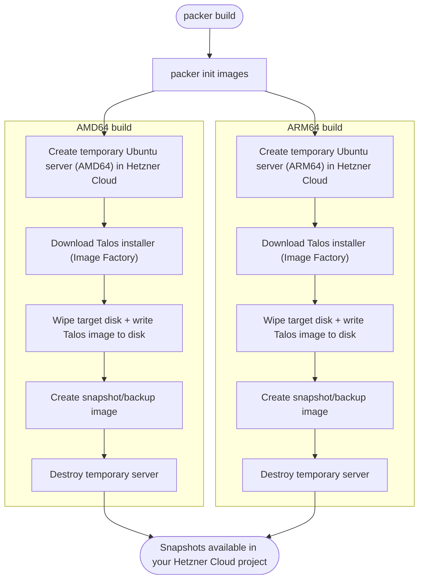

# CodeToInfra — Cluster images (Talos Linux on Hetzner Cloud)

This repository is part of the **CodeToInfra** demo/learning project. Start here: [`codetoinfra`](https://github.com/mariancraciun360/codetoinfra).

This repo builds **Talos Linux snapshots** (AMD64 + ARM64) for **Hetzner Cloud** using **Packer** and the **Talos Image Factory**.

## Prerequisites

- **Packer**: required to run the builds. This repo pins the expected version in `.tool-versions` (currently `packer 1.14.3`).
  - If you use `asdf`, you can install it from the pinned version:

```bash
asdf plugin add packer || true
asdf install
```

- **Hetzner Cloud API token**: required for Packer to create resources and snapshots in your project.
- **curl**: used to create a Talos Image Factory schematic ID (optional but recommended).
- **jq** (optional): convenient for extracting the schematic ID from the Image Factory response.

## Configure Credentials

Export your token (for example via `direnv` in `.envrc`):

```bash
export HCLOUD_TOKEN="token"
```

## Build Talos images

This configuration builds Talos Linux snapshots for both AMD64 and ARM64 architectures using the Talos Image Factory.

## How the build works (high level)



### Create a Talos schematic ID (recommended)

This repo includes a suggested schematic at `talos/schematic.yaml`. You can create a new schematic in the Talos Image Factory with `curl`:

```bash
curl -X POST --data-binary @talos/schematic.yaml https://factory.talos.dev/schematics
```

The response is JSON and includes an `id` field. If you have `jq`, you can extract it directly:

```bash
curl -s -X POST --data-binary @talos/schematic.yaml https://factory.talos.dev/schematics | jq -r .id
```

Use that value as `talos_schematic_id` in your Packer variables (see below).

### Variables

You need to provide the following variables. You can create a `talos.pkrvars.hcl` file:

```hcl
server_location    = "fsn1"
talos_version      = "v1.7.6"
talos_schematic_id = "376567988ad370138ad8b2698212367b8edcb69b5fd68c80be1f2ec7d603b4ba"
```

### Build

```bash
packer init images
packer build -var-file=talos.pkrvars.hcl images
```
